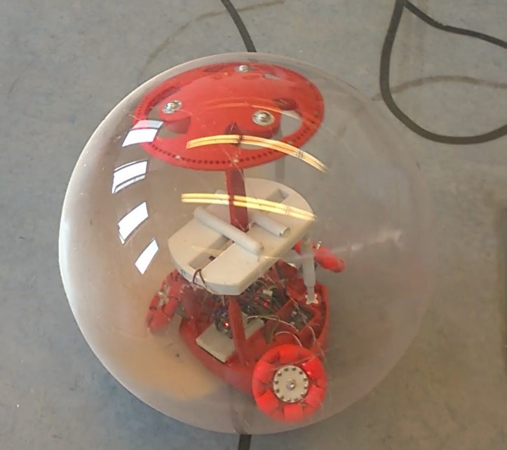

# BB-8 

## What is this repo for

In this repo I will show You how to set-up the BB-8 droid. You could download the appropriate file which is operating the robot. You will have a brief introduction to assemble the system and connect the mobile application with the ESP-32 modul BB-8 inside.


### Prerequisites


What things you need to upload the control software to BB-8 and how to get control above it.


- Arudino [IDE](https://www.arduino.cc/en/Main/Software/)
- ESP-32 hardware folder for the IDE[link in the future]
- Blynk Andorid [App](https://play.google.com/store/apps/details?id=cc.blynk&hl=en_US)


### Installing

You can follow these steps to be able to use the droid:

- Download the Blynk app to you mobile phone using the link above.

- Create the following board with the following settings:


- Upload the body-s controller conde to the ESP module with the Ardunio IDE paying attention to the following code parts:
```
//example 
char auth[] = "4191ba0acfbb4d3583f420c3d9d0ef1e"; //specific for every Blynk project and user (You can create it with the Blink app)
char ssid[] = "J.A.R.V.I.S.";                     //your hotspot's wifi name
char pass[] = "tonystarkdiesinendgame";           //your hotspot's wifi password
```

- Use the following instructions to wiring:

<br/>


```
1. MOTOR:
PIN1 = ESP pin 26  
PIN2 = ESP pin 25  
L928N ENABLE = ESP pin 27
ENCODER A PHASE = 33      //or check the increment counter in the ESP code if it's contuning down it's wrong
ENCODER B PHASE = 32


2. MOTOR:
PIN1 = ESP pin 18
PIN2 = ESP pin 19
L928N ENABLE = ESP pin 5
ENCODER A PHASE = 13
ENCODER B PHASE = 14

3. MOTOR:
PIN1 = ESP pin 16
PIN2 = ESP pin 17
L928N ENABLE = ESP pin 4
ENCODER A PHASE = 35
ENCODER B PHASE = 34

for all motor:
ENCODER+ = ESP 3.3V output
ENCODER- = ESP GND

```


- Connect the power source to the Body's motherboard and wait for the ESP-Mobile connection. If the connection is successfull the 
little red sing will disappear in the Blynk' board.

- Try to control the motors.


## Authors

* **Karoly Poka** :godmode: - *BSc-thesis* - electrical engieneering-control systems :electric_plug:

## License
Without my marvelous hardware this repo does not worth a shit to You but if it does..."WE HAVE A HULK” .

## Acknowledgments

* Myself
* Star Wars movie
* Dr. Tevesz Gábor: Robotirányítás rendszertechnikája, Elektornikus jegyzet, 6. fejezet, 2017
* Lantos Béla-Irányítási Rendszerek Elmélete és Tervezése I. Egyváltozós szabályozások (Akadémia Kiadó, Budapest)
